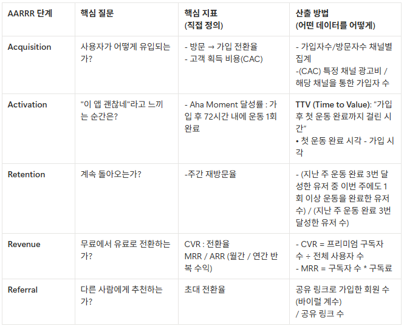

### FitOn 비즈니스 모델

| **항목** | **설명** |
| --- | --- |
| **타겟** | **"헬스장 가기 귀찮은데 운동은 하고 싶은" 2030 직장인** |
| **핵심 가치** | **"나만의 트레이너"가 매일 맞춤 운동 플랜을 만들어주는 AI 피트니스** |
| **수익 구조** | **Freemium — 무료(주 3회 운동 + 광고) vs Premium(월정액 구독, 무제한 + AI 코치)** |
| **경쟁 우위** | **AI가 체력·목표·스케줄에 맞춰 운동을 자동 구성 + 실시간 자세 보정** |

## **[1] 과제 1: AARRR 지표 정의**

### **(1) 각 단계에 맞는 지표 정의**

- 운동 완료 : 주에 운동 3번 완료

### **(2) 왜 그 지표인가?**

각 단계에서 정의한 지표가 "왜 핵심인지" 한 줄로 적어보세요.

Freemium + 습관 형성 비즈니스의 특성을 고려해보세요.

- `Acquisition`: 무료 유입이 핵심인 Freemium 구조에서, 얼마나 효율적으로 가입까지 전환시키는지가 전체 퍼널의 출발점이기 때문
- `Activation`: 운동 앱은 ‘첫 운동 경험’이 있어야 가치가 인식되므로 초기 행동(첫 운동 완료)까지의 속도가 이탈을 좌우하기 때문
- `Retention`: 습관 형성 서비스의 본질은 반복 사용이므로 지속적으로 운동을 이어가는 비율이 서비스 성공을 결정하기 때문
- `Revenue`: 무료 사용자 기반에서 수익은 일부 유료 전환에 의존하므로 얼마나 효과적으로 유료 전환 및 반복 수익을 만드는지가 핵심이기 때문
- `Referral`: 콘텐츠 기반 피트니스 앱은 네트워크 효과와 자발적 공유가 중요하므로 사용자가 다른 사용자를 데려오는 구조가 성장을 가속하기 때문

### 

## **[2] 과제 2: 병목 판단**

### **(1) 데이터를 읽고 병목을 찾으세요**

아래는 FitOn의 최근 1분기 AARRR 데이터입니다.

이 데이터를 보고 가장 큰 병목이 어디인지 판단하세요.

AARRR 스코어카드 (최근 1분기)

| AARRR 단계 | 지표 | 수치 | 업계 벤치마크 |
| --- | --- | --- | --- |
| Acquisition | 분기 신규 가입자 | 620,000명 | - |
| Activation | 가입 7일 내 첫 운동 완료율 | 52% | 45~60% |
| **Retention** | **W4 Retention Rate (가입 4주 후 주간 운동 1회 이상)** | **18%** | **25~35%** |
| Revenue | Free → Premium 전환율 (3개월 누적) | 6% | 8~15% |
| Referral | 운동 기록 공유 → 신규 가입 전환율 | 7.2% | 5~10% |

병목 판단:

- 가장 큰 병목 단계: Retention
- 판단 근거 (숫자로): 업계 벤치마크 대비 최소 -7%p ~ 최대 -17%p로 전 구간 중 격차가 가장 큼
- 이 단계가 병목인 이유 (한 문장): 여러 단계에서 업계 벤치마크 수준의 퍼포먼스를 보여주는데, Retention 단계에서 현저히 업계 평균보다 수치가 낮아, 수익 전환이 비교적 잘 안되는 것으로 판단

### **(2) 병목 단계를 더 깊이 파보세요**

병목으로 Retention이 식별되었다고 가정합니다.

아래 데이터를 보고 구체적으로 어디서 문제가 생기는지 파악하세요.

### 질문 1: Retention 곡선에서 가장 급격한 이탈이 발생하는 구간은?

주간별 Retention 곡선 (코호트 평균)

| 시점 | 주간 운동 1회 이상 사용자 비율 |
| --- | --- |
| W0 (가입 주) | 100% |
| W1 | 41% |
| W2 | 28% |
| W3 | 22% |
| W4 | 18% |
| W8 | 11% |
| W12 | 8% |
- 가입 주 → W1 : 초기 서비스의 저항이 높다?
- 왜 이 구간에서 이탈이 심할까요? (가설 2개)
    - 가설1: AI 코치 기능이 유저의 기대치에 미치지 못함
    - 가설2: 어플의 인터페이스가 사용자 친화적이지 못함

### 질문 2: 온보딩 유형별 차이에서 발견한 인사이트는?

온보딩 유형별 Retention 비교

| 온보딩 유형 | 사용자 수 | W1 Retention | W4 Retention | Premium 전환율 (3M) |
| --- | --- | --- | --- | --- |
| 목표 설정 스킵 (바로 운동 시작) | 186,000 | 22% | 9% | 3% |
| 목표 설정 + 체력 테스트만 완료 | 248,000 | 38% | 16% | 5% |
| 목표 설정 + 체력 테스트 + 주간 스케줄 생성 | 186,000 | 63% | 34% | 12% |
- `Aha Moment` 후보: 주간 스케줄 생성
    - 온보딩 완료: 온보딩을 마친 유저는 뚜렷한 운동 스케줄(주간스케줄)이 생겨 전환율이 높음
- `근거 (숫자)`: 주간 스케줄 생성 기능을 활용한 유저들이 W1 대비 W4의 리텐션 비율이 높고, Premium 전환율 또한 높다.
    - 온보딩을 끝까지 완료한 유저들이 W1 대비 W4의 리텐션 비율이 높고, Premium 전환율 또한 높다.
- `PM에게 제안할 액션`: 주간 스케줄 생성을 필수 단계로 개편; 스케줄 생성이 습관과 매출을 함께 올리는 레버로 작동하므로
    - 온보딩을 단계를 간소화 하여 유저들이 skip 하지 않도록 개편