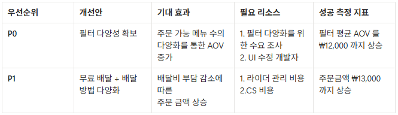

# **실전! AARRR 의사결정 보고서**

당신은 건강 맞춤 배달 앱 핏밀(FitMeal)의 데이터 분석가입니다.

CEO가 주간 회의에서 물었습니다:

"성장 병목을 찾았으면, 그래서 뭘 해야 하는 건데?"

### 비즈니스 모델

| 항목 | 설명 |
| --- | --- |
| 타겟 | "내 혈당·근육량에 맞는 음식을 배달시켜 먹고 싶은" 건강 관리 2030 직장인 |
| 핵심 가치 | 웨어러블/건강검진 데이터 연동 → "지금 먹어도 되는 메뉴" 필터링 + 추천 |
| 수익 구조 | 음식점 수수료(12%) + 사용자 배달비(₩3,500) + 프리미엄 구독(월 ₩9,900 — 배달비 무료 + AI 영양 코치) |
| 경쟁 우위 | 건강 데이터 기반 개인화 추천 — 혈당 스파이크 예방, 단백질 목표량 맞춤, 칼로리 예산 자동 계산 |

### 

## **[1] 과제 1: 현황 요약하기**

### **(1) AARRR 스코어카드를 해석하세요**

아래는 핏밀의 최근 1분기 데이터입니다.

CEO가 5분 안에 읽을 수 있는 현황 요약을 작성하세요.

AARRR 스코어카드 (최근 1분기)

| AARRR 단계 | 지표 | 수치 | 업계 벤치마크 |
| --- | --- | --- | --- |
| Acquisition | 월간 신규 가입자 | 78,000명 | - |
| Activation | 가입 7일 내 건강 데이터 연동 + 첫 주문 완료율 | 33% | 30~45% |
| Retention | M2 Retention (가입 2개월 후 월간 주문 1회 이상) | 42% | 30~45% |
| Revenue | 주문당 평균 결제액 (AOV) | ₩11,200 | ₩16,000~22,000 |
| Referral | 초대 쿠폰 → 신규 주문 전환율 | 8.3% | 5~9% |

현황 요약을 작성하세요:

| AARRR 단계 | 현재 값 | 벤치마크 대비 | 판단 |
| --- | --- | --- | --- |
| Acquisition | 78,000 | - | ✅ |
| Activation | 33% | 30~45% | ⚠️ |
| Retention | 42% | 30~45% | ✅ |
| Revenue | ₩11,200 | ₩16,000~22,000 | 🚨 |
| Referral | 8.3% | 5~9% | ✅ |
- ✅ 양호 = 벤치마크 범위 내
- ⚠️ 주의 = 벤치마크 하단
- 🚨 위험 = 벤치마크 미달

### 

## **[2] 과제 2: 병목 진단과 원인 분석**

### **(1) Revenue 병목을 깊이 파보세요**

AOV(평균주문금액)가 낮은 이유를 찾기 위해 세부 데이터를 분석합니다.

아래 데이터를 보고 구체적으로 어디서 문제가 생기는지 파악하세요.

> 주문 음식 카테고리별 분포

| 카테고리 | 주문 비율 | 평균 AOV | 건강 점수 평균 |
| --- | --- | --- | --- |
| 샐러드/포케 | 52% | ₩9,800 | 92점 |
| 닭가슴/도시락 | 28% | ₩12,500 | 85점 |
| 일반식 (한식/양식/중식) | 13% | ₩18,200 | 68점 |
| 간식/음료 | 7% | ₩6,400 | 78점 |

> 건강 필터 설정별 사용자 행동

| 필터 모드 | 사용자 비율 | 평균 AOV | 주문 가능 메뉴 수 | 월간 주문 횟수 |
| --- | --- | --- | --- | --- |
| 엄격 모드 ("내 목표에 딱 맞는 것만") | 61% | ₩9,400 | 평균 8개 | 4.2회 |
| 유연 모드 ("대체로 괜찮으면 OK") | 24% | ₩14,100 | 평균 23개 | 6.8회 |
| 필터 미사용 ("그냥 내가 골라서") | 15% | ₩16,900 | 전체 | 3.1회 |

### 질문 1: AOV가 낮은 근본 원인은?

- 핵심 발견: 저단가 카테고리 쏠림 현상 / 사용자의 과반수 이상이 선호도가 뚜렷함
- 원인 가설 (2개)
    - 건강 필터가 AOV를 구조적으로 낮추고 있다
    - 건강 필터 기준이 엄격함
    > - 가설 1: “엄격 모드의 추천/필터 로직이 건강점수를 최우선으로 두면서 고가 메뉴가 필터링되어, 결과적으로 샐러드/포케 등 저단가 카테고리로 주문이 쏠리고 AOV가 하락한다.”
    > - 가설 2: “엄격 모드는 주문 가능 메뉴가 평균 8개로 지나치게 좁아 사용자가 ‘익숙한 저가 메뉴 반복’으로 수렴하며, 이는 가격 다양성 감소와 AOV 하락으로 이어진다.”

### 질문 2: 프리미엄 구독자의 AOV가 높은 이유는?

> 프리미엄 구독자 vs 무료 사용자 비교

| 구분 | 사용자 수 | 평균 AOV | 월간 주문 횟수 | 유연 모드 사용률 |
| --- | --- | --- | --- | --- |
| 무료 사용자 (배달비 ₩3,500) | 61,000 | ₩9,800 | 3.8회 | 16% |
| 프리미엄 구독자 (배달비 무료 + AI 코치) | 17,000 | ₩15,800 | 7.4회 | 58% |
- 발견한 인사이트: 무료 사용자들이 유료 사용자보다 건강 기준이 엄격하고 주문 횟수가 적은 경향이 있다.
- 근거 (숫자):
    - 무료 사용자의 유연모드 사용률이 프리미엄 사용자보다 32%p 낮음.
    - 무료 사용자에 비해 프리미엄 구독자의 평균 AOV가 6,000원 높게 나타남.
    - 무료 사용자에 비해 프리미엄 구독자의 월간 주문 횟수가 3.6회 더 나타남.

### **(2) 의사결정 보고서 형식으로 정리하세요**

앞서 배운 [현상] → [원인 가설] → [근거] → [제안] 형식으로 작성하세요.

> [현상]

무료 사용자들의 유연모드 사용률이 낮아 저단가 카테고리로 주문 쏠림 현상이 발생하고, 이에 따라 AOV가 작게 나타난다.

> [원인 가설]

- 추천 알고리즘의 편향성 : 알고리즘이 단가가 낮은 카테고리를 편향적으로 추천해줌
- 배달비 무료 혜택 : 프리미엄 구독자는 배달비 무료 혜택 덕분에 배달비에 대한 매몰 비용 걱정 없이 유연모드 사용률이 높다.

> [근거]

- 엄격 모드의 경우 주문 가능 메뉴 수가 8개뿐이며, 평균 AOV가 9,400원으로 낮음

> [제안]

- 선택지 A:

필터의 다양성 확보를 통해 무료 사용자(엄격 필터 多)가 선택할 수 있는 카테고리 품목을 늘림으로써 평균 AOV 성장을 촉진한다.

- 선택지 B:

배달비를 무료로 설정, 고객 등급에 따라 배달 방법(한집배달, 알뜰배달)에 차등을 두어 구독을 촉진, 주문의 가용 금액을 늘려 평균 AOV 성장을 촉진한다.

### 

### **[3] 과제 3: CEO 보고서 작성**

상황: CEO가 5분 안에 읽을 수 있는 분석 요약을 요청했습니다.

아래 형식으로 작성하세요.

핵심은 "그래서 뭘 해야 하는데?"에 답하는 것입니다.

① 병목 진단

- 가장 긴급한 병목: 무료 사용자의 AOV(₩9,800)가 낮음
- 근거 데이터: 무료 사용자 비율(78%)에 따른 AOV(₩9,800)
- 원인 가설:
    - 추천 알고리즘의 편향성 : 알고리즘이 단가가 낮은 카테고리를 편향적으로 추천해줌
    - 배달비 무료 혜택 : 프리미엄 구독자는 배달비 무료 혜택 덕분에 배달비에 대한 매몰 비용 걱정 없이 유연모드 사용률이 높다.

② 개선 제안 (우선순위 순)

③ 숫자로 설득하기

P0 제안의 비용 · 효과 · 횟수를 숫자로 정리하세요.

아래 데이터를 활용하세요:

- 현재 월간 주문 건수: 362,000건
- 엄격 모드 사용 비율: 61%
- 엄격 → 유연 모드 전환 시 예상 AOV 변화: ₩9,400 → ₩14,100 (+₩4,700)
- 전환 예상율: 엄격 모드 사용자의 40%가 유연 모드로 전환 (프리미엄 구독자 유연 모드 비율 58%의 약 70% 수준)
- UI 변경 개발 비용: ₩8M (일회성)

---

- 대상 주문 건수 (362,000 × 61%): 220,820건
- 유연 모드 전환 예상 건수: 220,820 × 0.40 = **88,328건/월** (전환되는 주문)
- 예상 추가 매출: 88,328 × 4,700 = ₩415,141,600 /월
    
    수수료율 : 월 ₩4억1천5 × 12% = 약 월 ₩50,000,000 (약 5천만원)
    

`이익 : 3억 6천만원`

> - 회수 기간: 58,000,000 / 415,141,600 = **0.13개월 ≈ 4일**

④ 다음 단계

- P0 제안의 효과를 확인하려면 어떤 분석을 추가로 해야 할까요?
    - A/B 테스트 : 기존 필터/변경 필터 기준으로 A/B 테스트 진행, 수익률 비교