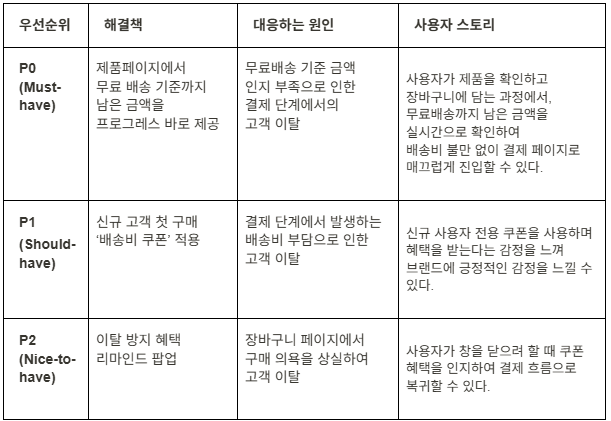
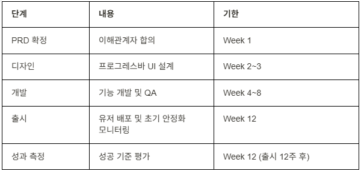
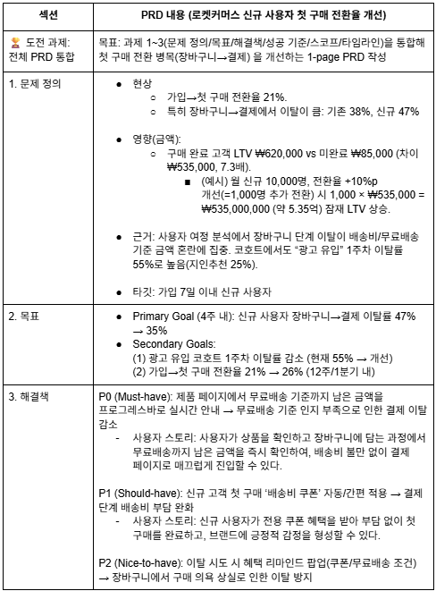
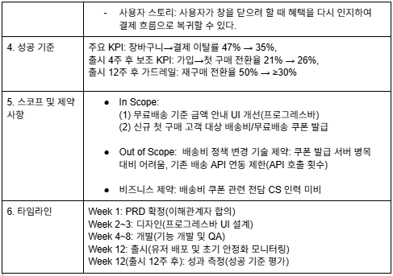

# 실전! PRD 작성하기
---
> 지금까지 배운 모든 분석 기법(퍼널, 코호트, LTV)과 PRD 구조를 활용하여, 로켓커머스의 실제 문제를 해결하는 PRD를 직접 작성해봅니다.

- 시나리오 설정
   - 상황: 당신은 로켓커머스의 주니어 데이터 분석가입니다.
  - 배경: 지난 분기 데이터 분석 결과, 신규 사용자의 첫 구매 전환율이 낮아 
         성장에 병목이 되고 있음을 확인했습니다.
  - 미션: 분석 결과를 바탕으로, 제품 개선을 제안하는 PRD를 작성하세요.

## 분석 결과 요약

[1] 문제 정의 및 목표 설정

1-1. 문제 정의 작성 
- 현상:
  - 장바구니 → 결제 과정에서 기존 고객 38%, 신규 가입자 47%의 이탈률이 나타남. 
    
    첫구매 완료 고객과 신규 고객의 LTV가 약 7.3배 차이를 보이기 때문에, 신규 가입자들의 장바구니 → 결제 과정 전환율을 높여야 함.
- 영향 (비즈니스에 미치는 영향을 숫자로)   
    - 첫 구매 완료 고객과 미완료 고객의 LTV 차이가 약 7.3배(535,000원 차이). 
    - (예시) 월 신규 가입자: 10,000명
    - 현재 전환율 21% -> 31%p (추가 전환 유저 : 10,000 x 10%p = 1000)
    - 첫 구매 완료 고객 LTV : 620,000
    - 미완료 고객 LTV : 85,000
    - 전환 시 : 620,000 - 85,000 = 535,000 
    - 최종 상승 : 1,000 X 535,000 = 535,000,000원 (약 5.35억)
- 근거: 
    - 전환 시 : 620,000 - 85,000 = 535,000 
    - 최종 상승 : 1,000 X 535,000 = 535,000,000원 (약 5.35억)
  
⇒ 전환율을 10%p만 개선해도 약 5.3억원의 잠재적 생애 가치(LTV) 상승을 기대할 수 있음
  
- 타깃 사용자: 
    - 가입 7일 이내 신규 사용자

1-2. SMART 목표 설정

주 목표 (Primary Goal):
- 장바구니 -> 결제 이탈률 저하 (47% -> 35%, 4주 내) 

보조 목표 (Secondary Goals):
- 1주차 광고 유입 코호트 이탈률 저하
- 가입 -> 첫 구매 전환율, 21->26% 개선 (12주 내, 1분기)

[2] 해결책 및 성공 기준
: 근본 원인에 대응하는 해결책을 설계하고, 성공 기준을 정의하세요.

2-1. 해결책 및 우선순위

2-2. 성공 기준 설계

[3] 스코프, 타임라인, 그리고 전체 PRD 통합

3-1. 스코프 정의

- In Scope
  - 무료배송 기준 금액 안내 UI 개선(프로그래스바)
  - 신규 첫 구매 고객 대상 무료배송 쿠폰 발급
- Out of Scope
    - 배송비 정책 변경
- 기술 제약
  - 쿠폰 발급 서버 병목 대비 불가 
  - 기존 배송 API 연동 제한 (API 호출 횟수)
- 비즈니스 제약 (보통은 인력 등 리소스의 한계)
  - 배송비 쿠폰 전담 CS 인력 미비

3-2. 타임라인

---
## 전체 PRD 통합

### 🛒 PRD: 로켓커머스 신규 사용자 첫 구매 전환율 개선

