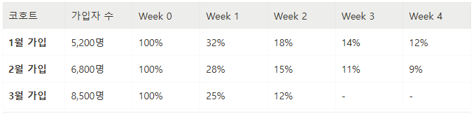
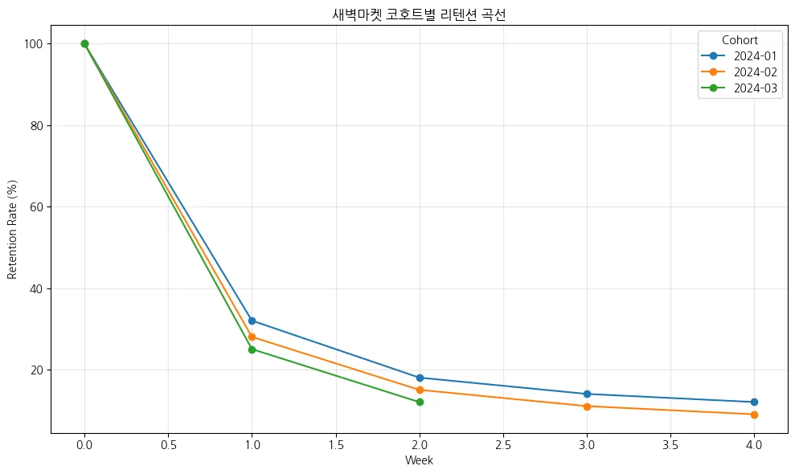

## 상황

새벽마켓의 데이터를 분석해서

(1) 리텐션 현황을 진단하고

(2) 근본 원인을 추정하고

(3) 아하 모먼트 가설을 세우는 것

---
# [1] 데이터 해석: 리텐션 곡선 읽기

아래는 새벽마켓의 최근 3개월 코호트별 리텐션 데이터입니다.

---

# [2] 원인 추정: 아하 모먼트 가설 수립

새벽마켓 데이터팀이 2월 코호트를 분석한 결과입니다.

"4주 이상 재방문"을 성공 기준으로 정했습니다.

| **가입 초기 행동 (7일 이내)** | **리테인 유저 비율** | **이탈 유저 비율** | **차이** |
| --- | --- | --- | --- |
| **앱 설치 후 회원가입** | 100% | 100% | 0%p |
| **카테고리 3개 이상 탐색** | 72% | 58% | +14%p |
| **첫 주문 완료** | 88% | 31% | **+57%p** |
| **리뷰 작성** | 35% | 22% | +13%p |
| **즐겨찾기 3개 이상 등록** | 64% | 15% | **+49%p** |
| **친구 초대 링크 공유** | 18% | 12% | +6%p |

위 테이블에서 아하 모먼트 후보가 될 수 있는 행동을 골라보세요.

1. 두 그룹 간 **차이가 가장 큰 행동 2가지**는 무엇인가요?
    - 첫 주문 완료(57%) / 즐겨찾기 3개 이상 등록(49%)
2. 그 중 새벽마켓의 **핵심 가치("신선한 식재료 배송")와 더 직결되는 것**은 무엇인가요?
   - 첫 주문 완료(57%)
3. 아하 모먼트 **가설**을 "*_ 이내에* _을(를) 하는 것" 형식으로 작성해 보세요.
   - 가입 후 7일 이내 첫 주문을 완료하는 것
   
---

# [3] 액션 제안: PM에게 보고하기

여러분이 PM에게 보고한다면 어떻게 정리하겠습니까? 아래 틀을 채워 보세요.

1. **현황**

- 가입자 수: *→* (성장 추세:5200 -> 8500)
- W1 리텐션: *→* (추세: 32% -> 28% -> 25%)
- Leaky Bucket 여부: 有

2. **핵심 문제**

- 가장 큰 이탈 구간: _가입 직후 첫 주 (W0->W1 구간)_
- 악화 추세: 1월에서 3월로 갈수록 가입자 수는 많아지지만, 리텐션은 감소함

3. **아하 모먼트 가설**

- 핵심 행동: 가입 후 7일 내 첫 주문 완료
- 가설: " *가입 후 7일 이내에 첫 주문을 완료* 하면 장기 리텐션이 높다"

4. **제안 액션**

- 단기:
    - 첫 구매 특가 쿠폰 발행 (사용기간: 7일 제한)
    - 가입 직후 사용 가능한 쿠폰/리워드 제공 (사용 기간: 7일 제한)
- 중기:
    - 주문 단계 최소화(UX 간소화)를 통한 주문 유도
    - 첫 주문 완료 유저 구매 품목 분석 후, 리텐션 높았던 카테고리 전면 배치