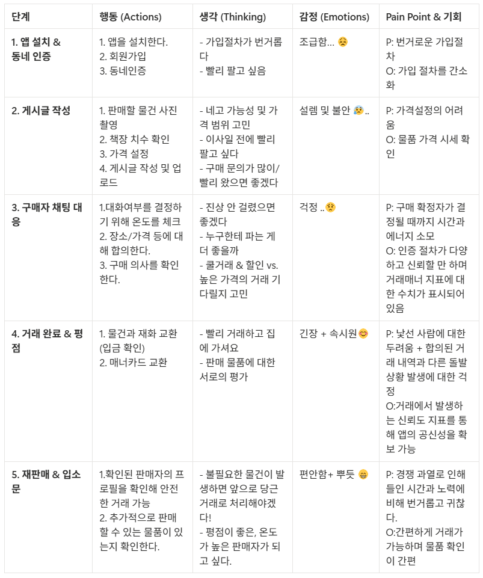
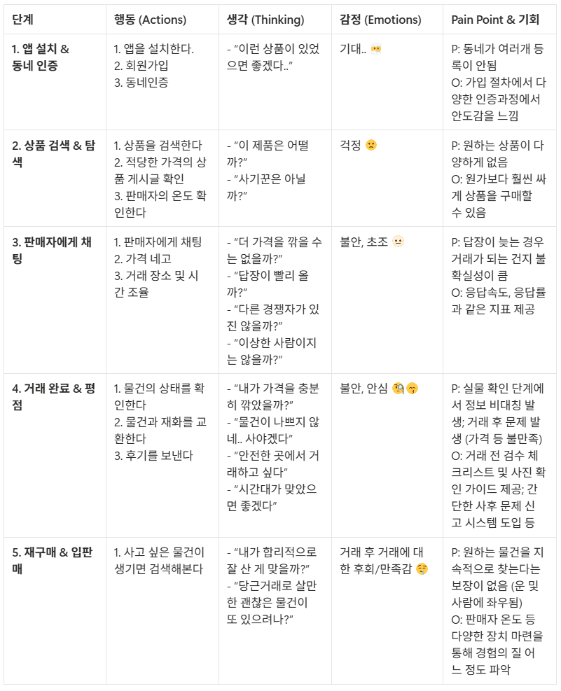

# **사용자 여정 분석**

홍당무마켓은 판매자와 구매자가 만나야 거래가 일어나는 **양면 플랫폼**입니다.

- 두 페르소나의 여정을 각각 그려보고
- 어디에서 만나는지 확인

---

이번 실습은 4단계로 진행:

1. 시나리오 확인 — 홍당무마켓의 양면 구조를 이해
2. 페르소나 설정 — 판매자 / 구매자 역할을 팀에서 나누기
3. 여정 지도 작성 — 판매자와 구매자 여정을 각각 채우기
4. 분석 및 개선 아이디어 도출 — 두 여정의 교차점에서 액션으로 연결
### 

# [1] 시나리오 설정

🥕 분석 서비스: 홍당무마켓 — 동네 기반 중고거래 플랫폼

- 판매자가 중고 물건을 등록하고 구매자를 찾아 거래하는 양면 플랫폼
- 채팅 기반 흥정, 동네 인증, 매너 시스템으로 신뢰 도모

💡**양면 플랫폼의 핵심**

판매자 없이는 구매자가 없고, 구매자 없이는 판매자도 없습니다.

두 사용자가 채팅에서 만나는 순간이 플랫폼이 가치를 만드는 지점입니다.

### 

# [2] 페르소나 설정하기

## (1) 판매자 페르소나

| **항목** | **내용** |
| --- | --- |
| 이름 / 나이 / 직업 | 김하이(37.3도) / 28 / 남 / 대학원생 / 사당역 / 미혼 / 혼자 거주 |
| 판매 계기 | 이사를 가려고 하는데 너무 무거운 책꽂이 + 전공서적을 처분하려는 상황 |
| 목표 | 빠르고 가까운 거리의 거래와 처분비용의 절감 |
| 판매 경험 | 중고거래 경험 다수 있음 / 시간 약속 미수 및 노쇼 걱정됨 |

## (2) 구매자 페르소나

| **항목** | **내용** |
| --- | --- |
| 이름 / 나이 / 직업 | 이하이(36.5도) / 23 / 여 / 대학생 / 서울대입구역 / 미혼 / 혼자 거주 / 대출 有 |
| 구매 계기 | 기숙사에서 나와 자취하는 상황, 전공서적이 필요한 상황 |
| 목표 | 원하는 물건을 가까운 거리에서 원가보다 싸게 사고 싶다. |
| 구매 경험 | 중고거래 1번 있음 / 물품 퀄리티에 대한 걱정 |

# 

# [3] 여정 지도 작성하기

## (1) 판매자 여정 지도

## (2) 구매자 여정 지도

🔄두 여정의 교차점: 채팅 ↔ 거래 완료

- 판매자의 "3단계: 구매자 채팅 대응"과 구매자의 "3단계: 판매자에게 채팅"이 만나는 순간입니다.
- 이 교차점에서 Pain Point가 겹치면(판매자는 노쇼 걱정, 구매자는 늦은 답장 불만) 플랫폼이 단일 개선으로 두 사용자 경험을 동시에 향상시킬 수 있습니다.
  
---

# [4] 분석 및 개선 아이디어 도출

완성된 여정 지도를 바탕으로 다음 질문에 답해 보세요.

## 과제 1: 핵심 문제 정의

> 판매자 / 구매자 여정 지도 각각에서 감정이 가장 크게 하락한 단계를 찾고,
원인과 개선 방향을 작성해 보세요.

- 판매자: 구매자 채팅 대응 - 여러 구매자의 성가신 요구 가 산재
- 구매자: 판매자에게 채팅 - 원하는 물건을 희망하는 가격대로 조정하는 게 어려움
- 두 여정에서 겹치는 문제는 무엇인가요?
    
    =>거래 물품에 대한 이해 차이로 인해 불필요하게 대화가 길어짐
    
- 단일 개선으로 둘 다 해결할 수 있는 것은 무엇인가요?
    
    => 채팅 시작할 때 모달창(예. 거래 가격) 띄워서 동의하였을 때만 채팅 입장 가능
    

## 과제 2: 정량·정성 결합 시나리오

다음 상황을 읽고 결합 분석 플로우를 완성하세요.

상황: 홍당무마켓의 "채팅 시작 → 거래 완료" 전환율이 38%입니다.

채팅을 시작한 10명 중 6명 이상이 실제 거래로 이어지지 않습니다.

> 1. *(정량 데이터로 식별)* 전환율 38%의 특징을 더 세분화하려면 어떤 분석을 하시겠습니까?
    
    (예: 판매자와 구매자 중 누가 먼저 대화를 중단하는지)
    
- 첫 응답 소요 시간
- 물품 카테고리 및 가격대별 세분화 분석
- 판매자와 구매자 사이의 거리
- 채팅 텍스트 감정분석
- 거래 유형별 거래완료 전환율
>2. *(정성 데이터로 탐색)* 원인을 알기 위해 어떤 정성 데이터를 수집하시겠습니까?
- 채팅 로그 텍스트 마이닝 (“깎아주세요”, “너무 멀어요” 등)
- 채팅 중단 후 특정 일수가 지나면, 거래로 전환되지 못한 이유에 대해 간단하거나 자세한 설문 작성을 보상을 통해 유도
>3. *(교차 검증)* 정성에서 "노쇼(no-show)"가 주요 원인으로 나왔다면,
    
    정량으로 어떻게 검증하시겠습니까?
    
- 거래 당일 응답 속도
- 약속 시간대별 노쇼 비율
- 첫 거래 vs 재거래 노쇼 비율
- 매너 온도별 노쇼 비율
---

# [5] 도전 과제: 여정 지도 통합 보고서

위 실습을 모두 통합하여, 홍당무마켓 사용자 여정 분석 보고서를 작성해 보세요.

## 1. 사용자 컨텍스트 (Zone A) - 하비님

## **👤 판매자 페르소나**

- **이름:** 김하이 (37.3도)
- **28세 / 대학원생 / 사당역 거주 / 1인 가구**
- **목표:** 이사 전 빠른 처분 + 비용 절감
- **처분품목**: 책꽂이 + 전공서
- **우려:** 노쇼, 시간 낭비, 진상 구매자
- **거래 경험:** 다수 있음 (피로도 존재)

## **👤 구매자 페르소나**

- **이름:** 이하이 (36.5도)
- **23세 / 대학생 / 서울대입구역 거주**
- **목표:** 원가보다 저렴한 합리적 구매
- **우려:** 사기, 품질 불일치, 거리 부담
- **거래 경험:** 1회 (불안 존재)

## 2. 여정 단계 (Zone B) - 승호님

- 판매자 단계 : 앱 설치/ 인증 -> 게시글 작성 -> 구매자 채팅 대응 -> 거래완료/평점 -> 재판매/입소문
- 구매자 단계: 앱 설치/ 인증 -> 상품 검색 & 탐색 -> 판매자와의 채팅 -> 거래완료/ 평점 -> 재구매/입소문
- 교차점 (두 여정이 만나는 단계) : **[채팅 ↔ 거래 완료]** 구간. 판매자의 대응과 구매자의 문의가 실시간으로 부딪히며 플랫폼의 실제 거래 가치가 창출되는 핵심 구간

## 3. 행동·생각·감정 (Zone C) - 하늘님

- 판매자 감정 곡선의 고저점:
    - 고점: 계획한 기간 내 거래를 완료를 해 기쁨
    - 저점: 게시물에 가격 제안 불가라고 명시했지만 구매자가 할인을 계속해서 요구해 불쾌
- 구매자 감정 곡선의 고저점:
    - 고점: 원하는 가격으로 판매자가 가격을 조정해줘 기쁨
    - 저점: 물건 상태가 게시물과 같지 않아 속상

## 4. 기회 (Zone D) - 혜민님

- 두 여정에서 겹치는 Pain Point: 물품 정보(가격, 상태)에 대한 동상이몽으로 인한 '소모적인 채팅 장기화’
- 단일 개선으로 해결 가능한 아이디어: [채팅 진입 전 모달창] 채팅 시작 버튼 클릭 시 '네고 불가 동의', '직거래 장소 확인' 등 주요 조건을 확인해야만 채팅방이 개설되도록 설정
- 효과 측정 지표: 채팅당 평균 메시지 수(감소), 채팅 시작 대비 거래 완료 전환율(상승)

## 5. 정량·정성 결합 계획 - 수빈님

- 정량으로 확인할 것:
    - 전환 퍼널: 채팅 시작 → 약속 확정 → 거래 완료 → 후기 작성
    - 판매자 첫 응답 시간/응답률별 거래 완료율
    - 카테고리·가격대·거리(동네)·온도 구간별 전환율
    - 채팅 메시지 수/길이/소요시간별 전환율 (긴 채팅이 오히려 실패인지 확인)
    - 노쇼 관련: 약속 확정 후 거래 미완료 비율, 시간대별 노쇼
- 정성으로 확인할 것:
    - 거래 실패 사유 수집: “왜 거래 안 했나요?” 초간단 설문(보상/배지)
        
        예: 가격, 거리, 답장 지연, 상태 불신, 시간 불일치, 태도 문제, 경쟁자 존재 등
        
    - 채팅 로그 텍스트 마이닝: 거래 실패를 유발하는 대표 키워드/패턴 추출
        
        예: “깎아주세요”, “너무 멀어요”, “하자 있나요?”, “예약됐나요?” 등
        
- 교차 검증 방법:
    - 정성에서 “노쇼가 많다”가 나오면 → 정량으로
        - 약속 확정 이후 미거래 비율(노쇼율) 확인
        - 약속 시간대별/거리별/온도별 노쇼율 비교
        - “채팅 전 거래조건 합의 여부(모달 사용 여부)”에 따른 노쇼율 비교
- 정성에서 “가격 기대치 차이”가 나오면 → 정량으로
    - 네고 시도(가격 관련 메시지 포함) vs 전환율
    - 가격대별/네고 범위 설정 여부별 전환율 비교
---

# [6] 정리

🔑실습 완료 체크리스트

- 판매자와 구매자 각각의 Pain Point를 1개씩 말할 수 있는가?
- 두 여정이 교차하는 단계가 어디인지 짚어낼 수 있는가?
- 결정적 순간(MoT)을 판매자·구매자 각 1개씩 찾았는가?
- Pain Point에서 구체적인 개선 아이디어와 측정 지표를 연결했는가?
- 정량·정성 데이터를 어떻게 교차 검증할지 설명할 수 있는가?